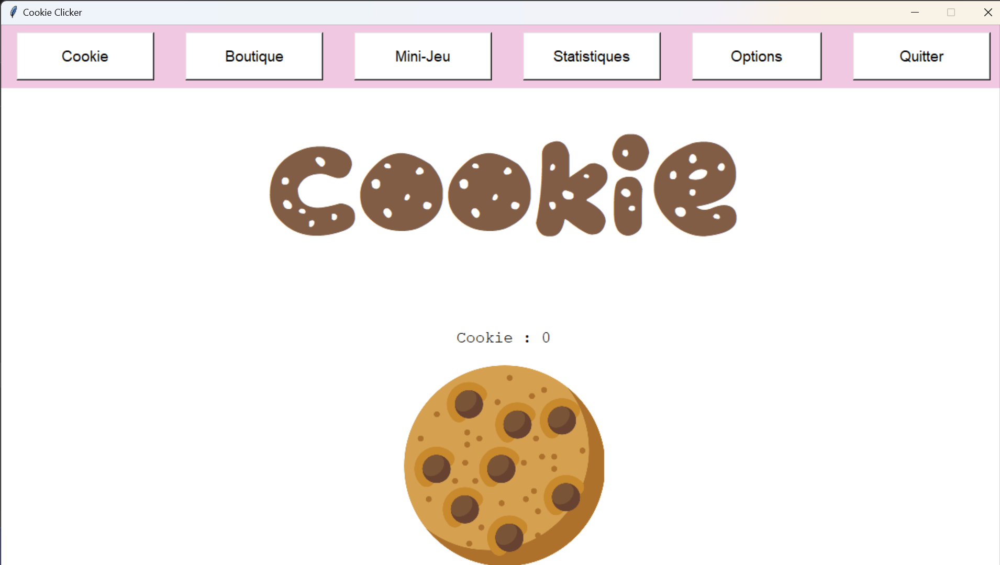

# Cookie Clicker

Le Cookie Clicker est un jeu amusant et addictif où les joueurs visent à accumuler autant de cookies que possible en cliquant sur une icône de cookie. Le jeu propose diverses améliorations, mini-jeux et options de personnalisation pour améliorer l'expérience de jeu. Que vous soyez un joueur occasionnel cherchant un passe-temps simple mais engageant, ou un fan des jeux incrémentaux, Cookie Clicker offre des heures de divertissement.




## Règles du Jeu

### Objectif Principal
Cliquez sur le cookie autant de fois que possible pour accumuler des cookies et atteindre différentes récompenses.

### Améliorations
Utilisez vos cookies accumulés pour acheter des améliorations et optimiser votre production de cookies :
- **Autoclick** : Permet à l'ordinateur d'augmenter automatiquement le nombre de cookies.
- **Clics par Seconde** : Augmente de 10 en 10 le nombre de cookies reçus par clic.
- **Roue de la fortune** : Une récompense aléatoire ajoutée au compteur. Un tour gratuit, dès le début de la partie ! 

### Avatars
Débloquez et personnalisez votre cookie avec différents avatars :
- Atteignez des paliers spécifiques pour débloquer de nouveaux avatars (par exemple, Avatar Plage à 100 000 cookies).
- Changez votre avatar à tout moment en utilisant ceux que vous avez déjà débloqués.

### Mini-Jeux
Accédez à divers mini-jeux pour diversifier votre plaisir et gagner des récompenses supplémentaires :
- Débloquez des mini-jeux en atteignant des paliers spécifiques.
- Les mini-jeux deviennent disponibles à nouveau après un certain temps.

### Statistiques
Consultez vos statistiques pour suivre votre progression et battre vos records :
- Meilleurs scores dans différents mini-jeux.
- Nombre maximal de cookies accumulés.
- Nombre total de clics manuels sur le cookie principal.
- Records de jeux précédents.
- Durée de jeu actuelle avec un chronomètre intégré.

### Options
Personnalisez votre expérience de jeu avec les options disponibles :
- Choisissez parmi différentes musiques pour accompagner votre session de jeu.
- Activez le mode sombre pour un affichage plus agréable dans les environnements à faible luminosité.
## Fonctionnalités

- **Mode clair/sombre** : Permet de basculer entre les modes de couleur selon vos préférences.
- **Sélection de musique** : Choisissez une musique pour accompagner votre expérience de jeu.
- **Horloge de jeu** : Suivez le temps écoulé pendant votre partie.
- **Sauvegarde des scores** : Gardez une trace de vos meilleures performances.
## Référencement des couleurs

| Color             | Hex                                                              |
| ----------------- |------------------------------------------------------------------|
| Rose1 |  #F1C8E1 |
| Marron1 |  #825D46 |
| Noir |  #212121 |
| Violet |  #A2739B |
| Marron2 |  #612E18 |
| Rose2 |  #FEDCE4 |
| Jaune |  #FAEFD6 |
| Bleu |  #D3E6FF |
| Blanc |  #FFFFFF |


## Auteurs

Ce jeu a été réalisé dans le cadre d'un projet de programmation informatique par deux élèves en deuxième année de prépa intégrée à Polytech Dijon :

- [@apoesp](https://github.com/apoesp)
- [@Fabaure](https://github.com/Fabaure)

## Installation

### Prérequis
- Python 3.x
- Tkinter (inclus avec Python sur la plupart des distributions)

### Instructions d'Installation
1. Clonez ce dépôt :
   ```bash
   git clone https://github.com/Fabaure/CookieClicker.git
   cd cookie-clicker
